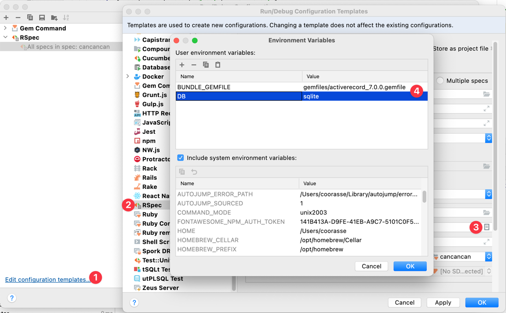

# CanCanCan


[](http://badge.fury.io/rb/cancancan)
[](https://github.com/CanCanCommunity/cancancan/actions/workflows/test.yml/badge.svg)
[](https://codeclimate.com/github/CanCanCommunity/cancancan)

[Developer guide](./docs/README.md) |
[RDocs](http://rdoc.info/projects/CanCanCommunity/cancancan) |
[Screencast 1](http://railscasts.com/episodes/192-authorization-with-cancan) |
[Screencast 2](https://www.youtube.com/watch?v=cTYu-OjUgDw)

CanCanCan is an authorization library for Ruby and Ruby on Rails which restricts what
resources a given user is allowed to access.

All permissions can be defined in one or multiple ability files and not duplicated across controllers, views,
and database queries, keeping your permissions logic in one place for easy maintenance and testing.

It consists of two main parts:
1. **Authorizations library** that allows you to define the rules to access different objects,
and provides helpers to check for those permissions.

2. **Rails helpers** to simplify the code in Rails Controllers by performing the loading and checking of permissions
of models automatically and reduce duplicated code.

## Our sponsors
<br/>
<a href="https://www.renuo.ch" target="_blank">
  
</a>
<br/>
<br/>
<br/>
<a href="https://www.moderntreasury.com" target="_blank"  style="display:inline">
  
</a>
<br/>
<br/>
<br/>
<a href="https://bullettrain.co" target="_blank">
  
</a>
<br/>
<br/>
<br/>
<a href="https://jobs.goboony.com/o/full-stack-ruby-on-rails-engineer" target="_blank">
  
</a>
<br />
<br />
<br />
<a href="https://newrelic.com/" target="_blank">
  
</a>
<br />
<br />
<br />
<a href="https://www.ontra.ai" target="_blank">
  
</a>
<br />
<br />
<br />
<a href="https://www.honeybadger.io/" target="_blank">
  
</a>
<br />
<br />

Do you want to sponsor CanCanCan and show your logo here?
Check our [Sponsors Page](https://github.com/sponsors/coorasse).

Head to our complete [Developer Guide](./docs/README.md) to learn how to use CanCanCan in details.

## Installation

Add this to your Gemfile:

    gem 'cancancan'

and run the `bundle install` command.

## Define Abilities

User permissions are defined in an `Ability` class.

    rails g cancan:ability

Here follows an example of rules defined to read a Post model.
```ruby
class Ability
  include CanCan::Ability

  def initialize(user)
    can :read, Post, public: true

    return unless user.present?  # additional permissions for logged in users (they can read their own posts)
    can :read, Post, user: user

    return unless user.admin?  # additional permissions for administrators
    can :read, Post
  end
end
```

## Check Abilities

The current user's permissions can then be checked using the `can?` and `cannot?` methods in views and controllers.

```erb
<% if can? :read, @post %>
  <%= link_to "View", @post %>
<% end %>
```

## Fetching records

One of the key features of CanCanCan, compared to other authorization libraries,
is the possibility to retrieve all the objects that the user is authorized to access.
The following:

```ruby
  @posts = Post.accessible_by(current_ability)
```

will use your rules to ensure that the user retrieves only a list of posts that can be read.

## Controller helpers

The `authorize!` method in the controller will raise an exception if the user is not able to perform the given action.

```ruby
def show
  @post = Post.find(params[:id])
  authorize! :read, @post
end
```

Setting this for every action can be tedious, therefore the `load_and_authorize_resource` method is provided to
automatically authorize all actions in a RESTful style resource controller.
It will use a before action to load the resource into an instance variable and authorize it for every action.

```ruby
class PostsController < ApplicationController
  load_and_authorize_resource

  def show
    # @post is already loaded and authorized
  end

  def index
    # @posts is already loaded with all posts the user is authorized to read
  end
end
```

## Documentation

Head to our complete [Developer Guide](./docs/README.md) to learn how to use CanCanCan in details.

## Questions?

If you have any question or doubt regarding CanCanCan which you cannot find the solution to in the
[documentation](./docs/README.md), please
[open a question on Stackoverflow](http://stackoverflow.com/questions/ask?tags=cancancan) with tag
[cancancan](http://stackoverflow.com/questions/tagged/cancancan)

## Bugs?

If you find a bug please add an [issue on GitHub](https://github.com/CanCanCommunity/cancancan/issues) or fork the project and send a pull request.

## Development

CanCanCan uses [appraisals](https://github.com/thoughtbot/appraisal) to test the code base against multiple versions
of Rails, as well as the different model adapters.

When first developing, you need to run `bundle install` and then `bundle exec appraisal install`, to install the different sets.

You can then run all appraisal files (like CI does), with `appraisal rake` or just run a specific set `DB='sqlite' bundle exec appraisal activerecord_5.2.2 rake`.

If you'd like to run a specific set of tests within a specific file or folder you can use `DB='sqlite' SPEC=path/to/file/or/folder bundle exec appraisal activerecord_5.2.2 rake`.

If you use RubyMine, you can run RSpec tests by configuring the RSpec configuration template like this:


See the [CONTRIBUTING](./CONTRIBUTING.md) for more information.

## Special Thanks

Thanks to our Sponsors and to all the [CanCanCan contributors](https://github.com/CanCanCommunity/cancancan/contributors).
See the [CHANGELOG](https://github.com/CanCanCommunity/cancancan/blob/main/CHANGELOG.md) for the full list.
